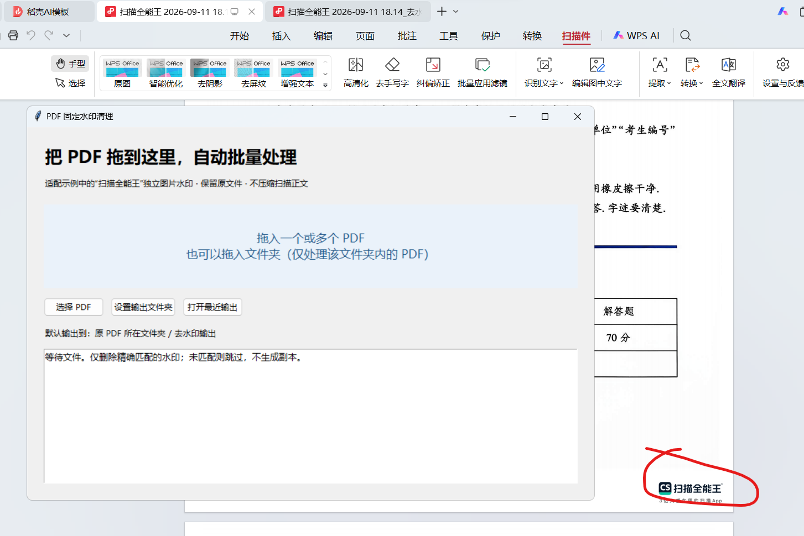
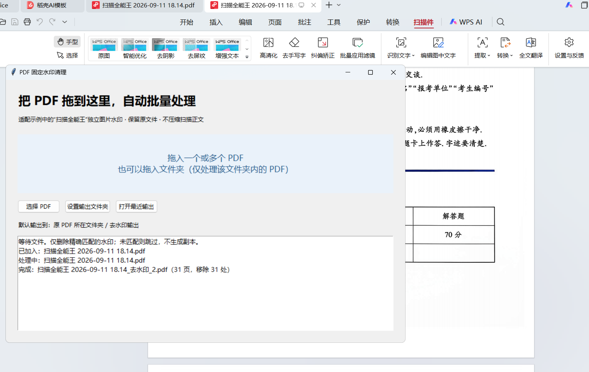

# PDF 水印清理 · 扫描全能王固定水印

Windows 本地批量处理工具，用于删除 PDF 右下角**精确匹配的“扫描全能王”独立图片水印**。支持把 PDF 拖入窗口，保留原文件，不重新扫描、涂白、OCR 或压缩正文。

> 仅适配特定水印模板，不是通用去水印工具。未匹配的文件会跳过，不生成副本。

## 效果展示

### 清理前

右下角红圈标出了示例中的水印。



### 清理后

同一示例的清理后截图；截图中的处理日志显示 31 页、移除 31 处。实际结果以所处理文件的日志为准。



## 快速使用

1. 下载仓库中的 [PDF水印清理.exe](PDF水印清理.exe)，双击运行，无需安装 Python。
2. 如需统一输出位置，先点击“设置输出文件夹”。
3. 将一个或多个 PDF 拖入窗口，也可以点击“选择 PDF”，或拖入文件夹（仅处理第一层 PDF）。
4. 等待日志显示完成，点击“打开最近输出”查看结果。

默认输出到原 PDF 旁的“去水印输出”文件夹，文件名为 `原文件名_去水印.pdf`。原文件始终保留；同名输出自动加序号。文件按队列逐个处理，单个失败不影响后续文件，处理时请保持窗口打开。

## 适用范围

- 当前识别规则来自《2025 计算机真题.pdf》中的独立图片水印，按图片尺寸和解码后内容的 SHA-256 精确匹配；相同模板可批量处理。
- 仅处理页面直接引用的目标水印，不自动删除其他图片、二维码或正文。
- 不支持已经与扫描正文合并的水印，也不保证匹配其他版本的同品牌标识。
- 加密 PDF 需要先解除密码；未找到匹配水印时直接跳过。
- 直接修改 PDF 图片绘制指令，保留页数、页面尺寸及原扫描图像数据。所有处理均在本机进行，无上传。

## 从源码运行

需要安装带 Tkinter 的 Python 3.9 或更新版本。在项目目录执行：

```powershell
python -m pip install -r requirements.txt
python app.py
```

命令行批量处理：

```powershell
python cleaner.py "输入.pdf" --output-dir "输出文件夹"
python cleaner.py "输入1.pdf" "输入2.pdf" --output-dir "输出文件夹"
```

省略 `--output-dir` 时，使用各输入文件旁的默认输出文件夹。

## 打包 Windows EXE

在 Windows 的 Python 环境中执行：

```powershell
python -m pip install -r requirements.txt
python -m pip install pyinstaller
python -m PyInstaller --noconfirm --onefile --windowed --collect-all tkinterdnd2 --name "PDF水印清理" app.py
```

生成文件位于 `dist/PDF水印清理.exe`。依赖清单未锁定版本，重新打包的结果可能与仓库中的便携版不同。

## 项目文件

| 文件 | 用途 |
| --- | --- |
| [PDF水印清理.exe](PDF水印清理.exe) | Windows 便携版 |
| [app.py](app.py) | 窗口、拖放、队列及处理日志 |
| [cleaner.py](cleaner.py) | 水印识别、PDF 清理及命令行入口 |
| [requirements.txt](requirements.txt) | Python 运行依赖 |
| [水印.png](水印.png)、[去除.png](去除.png) | README 使用的原始效果截图 |
